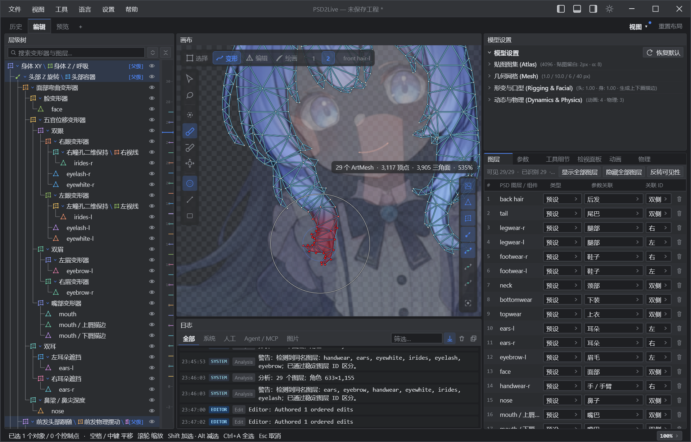
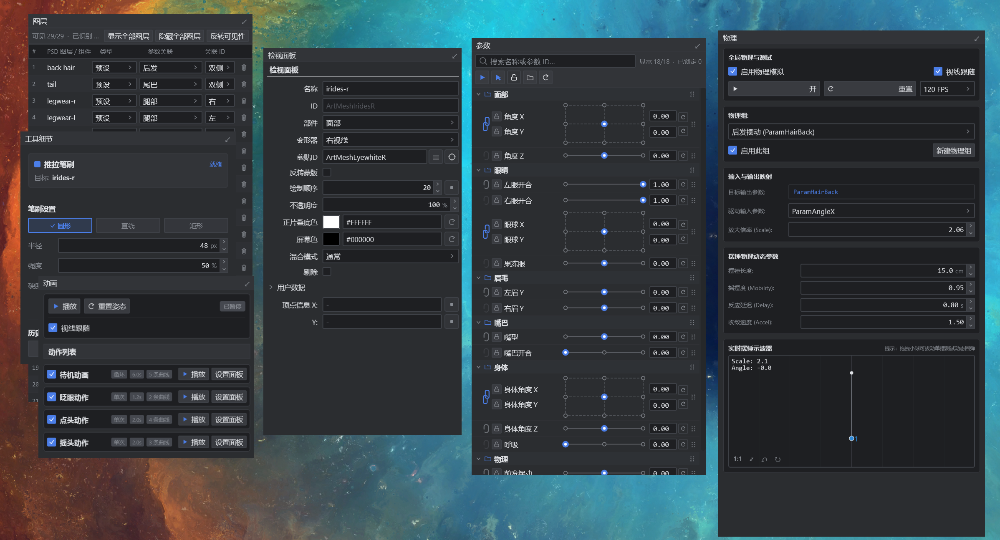

# PSD2Live

[English](README_en.md) · [日本語](README_ja.md) · [下载发行版](https://github.com/tsunehimatoi/psd2live/releases/latest) · [文档](docs/README.md)

**从分层 PSD 生成 Live2D 模型，再在同一个工作区里编辑、预览和导出。**

PSD2Live 会根据图层名称识别部件，生成网格、变形器、面部参数、基础动作和物理。你可以继续手动修形、绘画、添加差分与素材，也可以连接支持 MCP 的 Agent 协助编辑。



## 开始使用

Windows 10/11 x64 用户可下载便携 ZIP，解压后运行；也可使用 EXE / MSI 安装包。发布包包含 Java 运行时。

**Linux 目前提供部分支持**：同一发布页提供 Linux amd64 Deb，包含 Cubism Native 预览，需 X11/GLX。也可安装 JDK 21 后从源码运行 GUI / CLI，或在 Linux 本机生成需要系统 Java 的启动包；自行构建的默认包使用内置渲染。原生预览仅支持带 X11/GLX 的 Linux x86_64（包括 XWayland 和 Xvfb），暂不支持无 XWayland 的纯 Wayland、aarch64 或 musl / Alpine，详见 [SDK 配置说明](docs/zh/guide/CUBISM_SDK_SETUP.md)。

1. 导入分层 PSD：**文件 → 导入 PSD**（默认 `Ctrl+Shift+O`）。
2. 在预览页检查效果，在图层面板核对部件类型与左右侧别。
3. 按需编辑，使用 `Ctrl+S` 保存 `.psd2live` 工程。
4. 使用 `Ctrl+G` 打开导出设置，输出 `.cmo3` 或 `.moc3` 文件族。

**第一次使用，请打开「帮助 → 教程…」。** 程序内的交互教程会定位实际控件，引导完成导入、编辑、保存与导出；[文字速查](docs/zh/guide/USER_GUIDE.md)按相同的 14 课组织。

## 可以做什么

| 工作 | 功能 |
| --- | --- |
| 自动建模 | 多语言图层识别、成对部件拆分、自适应网格、头身变形、眼口开合与视线 |
| 画布编辑 | 选择 / 变形 / 编辑 / 绘画四种模式；形变笔刷、网格切割与细分、Warp / Rotation、Glue、实验性变形路径 |
| 素材与差分 | 导入透明图片并放置；开关差分、多选一切换差分；纹理修边补色；可选 2× / 4× 高清化 |
| 动态预览 | 参数滑块与二维关联、待机 / 眨眼 / 点头 / 摇头动作、视线跟随、头发与眼球物理 |
| 工程管理 | 单文件工程、分支历史、撤销重做、多标签页、可调整面板、明暗主题和快捷键预设 |
| Agent 协作 | 本地带认证的 MCP；读取模型、观察姿态、导入素材、编辑参数与形状、恢复历史 |



自动结果取决于 PSD 分层与原画。建议先阅读[素材准备与命名](docs/zh/spec/PSD_LAYER_SPEC.md)：眼白、瞳孔、上睫毛分层；嘴巴提供张口素材；前后发分开；身体保持基本正立。未识别图层可在界面中手动指定类型。

## 保存与导出

| 文件 | 用途 |
| --- | --- |
| `.psd2live` | 本程序工程：原始 PSD、素材、设置、编辑与历史分支，用于继续工作 |
| `.cmo3` | Cubism 编辑器工程，用于后续检查和精修 |
| `.moc3` + `.model3.json` + 纹理等 | 运行时模型文件族，需一起交付 |
| `.psd2live.json` | 导出诊断与映射报告，不能代替工程 |

动作、物理与显示信息按导出选项生成。默认使用内置渲染；官方 Native SDK 预览是[可选配置](docs/zh/guide/CUBISM_SDK_SETUP.md)，不属于基本导出的前置条件。格式支持和效果一致性有边界，见[运行时与导出说明](docs/zh/spec/RUNTIME_EXPORT_ARCHITECTURE_AND_GAPS.md)。

## 连接 Agent

打开 **工具 → MCP → MCP 连接与安装…**，复制当前宿主对应的配置并保持应用运行。支持 Streamable HTTP 的宿主直接连接；仅支持 Stdio 时使用仓库中的 `mcp_proxy.py`。

当前公开 11 个工具，包含模型观察、形状与路径编辑、素材、参数、物理和历史操作。接入步骤与可调用示例见 [MCP 使用与接口](docs/zh/agent/MCP_AUTHORING.md)。涉及生成新图片的任务需要宿主提供图像生成能力。

工具可调用不等于复杂建模任务已经可靠。[实测记录](STATUS.md)保留成功与失败样本，[路线图](ROADMAP.md)记录后续工作。

## 从源码运行

需要 JDK 21。Windows 可执行 `run-gui.bat`，或使用 Gradle Wrapper：

```powershell
.\gradlew.bat run
.\gradlew.bat run --args="--input examples/tml/psd-input/tml.psd --output build/example-output"
.\gradlew.bat test
```

Linux 在仓库根目录运行以下命令（macOS 源码运行同样使用 `./gradlew`）：

```bash
./gradlew run
./gradlew run --args="--input examples/tml/psd-input/tml.psd --output build/example-output"
./native/package_linux.sh
```

打包脚本在 `dist/linux-<时间戳>/` 生成 `psd2live.sh` 启动器，运行时需安装 JDK 21。该脚本默认生成的本地包不含官方 Cubism SDK；如需自行构建 Linux x86_64 原生预览，参见 [Native 构建与打包说明](native/README.md)。构建、CLI 完整参数及其他发布方式见[开发与命令行](docs/zh/guide/DEVELOPMENT.md)。

## 文档与贡献

- [操作速查](docs/zh/guide/USER_GUIDE.md)：与程序内教程对应的简版步骤。
- [画布编辑](docs/zh/guide/CANVAS_EDITOR.md)：模式、编辑目标与提交行为。
- [全部文档](docs/README.md)：素材、工程格式、实现、SDK 与 Agent 参考。
- [示例](examples/readme.md)：输入、输出与各素材使用说明。

欢迎提交问题、可复现 PSD、文档修正和代码改进。报告问题时附版本、系统、操作步骤、预期效果与相关日志；提交代码前运行与改动相关的检查。Agent 案例请同时记录宿主、模型、返工次数与消耗。

## 许可

代码采用 [GPL-3.0](LICENSE)，第三方来源见 [THIRD_PARTY_NOTICES.md](THIRD_PARTY_NOTICES.md)，示例素材另有说明。PSD2Live 是独立项目，与 Live2D Inc. 无隶属或赞助关系；本仓库不分发官方专有 SDK。用于正式交付前，请在目标编辑器和运行环境中检查生成结果。
