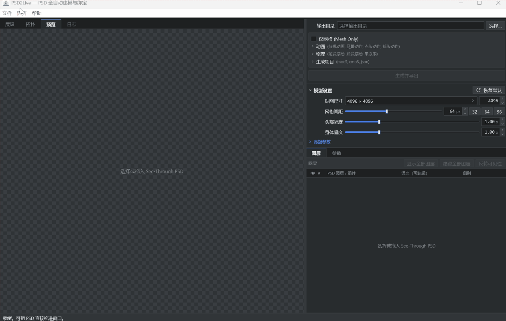
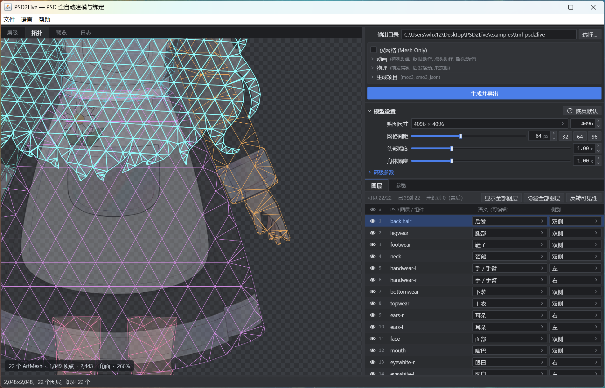

# PSD2Live

[中文](README.md) | [日本語](README_ja.md)

PSD2Live is an automated Live2D model generation pipeline and desktop application. Given a layered PSD file, the system automatically performs semantic layer recognition, 8-connected bilateral splitting, adaptive Delaunay mesh triangulation, 9-pose facial lattice construction, multi-pendulum hair dynamics, and seamless idle loop generation, exporting both editable `.cmo3` editor projects and runtime `.moc3` file families.

<p align="center">
  
  <br>
  <em>End-to-end automated modeling, real-time gaze tracking, and dynamic preview</em>
</p>

---

## Documentation Index

| Document | Description |
| :--- | :--- |
| [User Guide (docs/en/USER_GUIDE.md)](docs/en/USER_GUIDE.md) | Desktop GUI layout, 4 workspace views, viewport navigation, shortcuts, and CLI reference |
| [Live2D SDK Setup Guide (docs/en/CUBISM_SDK_SETUP.md)](docs/en/CUBISM_SDK_SETUP.md) | Official Native SDK license policy, shader extraction, and hardware-accelerated preview setup |
| [PSD Layer Specification (docs/en/PSD_LAYER_SPEC.md)](docs/en/PSD_LAYER_SPEC.md) | 31 semantic tags, side resolution rules, connected-component splitting, and layering guidelines |
| [Deformer & Math Specification (docs/en/DEFORMER_AND_PARAMETER_SPEC.md)](docs/en/DEFORMER_AND_PARAMETER_SPEC.md) | Deformer tree topology, 9-pose facial lattice math, C1 roll curve, feature warps, and physics |
| [Implementation Comparison (docs/en/IMPLEMENTATION_COMPARISON.md)](docs/en/IMPLEMENTATION_COMPARISON.md) | Technical comparison across 16 pipeline stages, coordinate invariants, and integrity verification |

---

## Core Features

- **Adaptive Mesh Generation**: Separable Gaussian alpha pre-filtering and adaptive binarization; periodic cubic Bézier fitting with physical support window corner detection and curvature-weighted adaptive resampling (up to 12x); constrained Delaunay triangulation with topology-convergent Lawson flips and overlong internal edge bisection.

  <p align="center">
    
    <br>
    <em>Desktop GUI Topology View: Semantic layer recognition & adaptive Delaunay mesh triangulation</em>
  </p>
- **Deformer (Warp) Generation**:
  - **Eye & Mouth Deformation**: Shared projective plane constraints for eyes and brows, iris counter-translation against perspective compression, and eyelash alpha-weighted centerline tracking for smooth closed U-curves; centripetal compression of full-open mouth toward central seam with auto-clipped teeth and tongue.
  - **Nine-Pose Lattice Construction**: `AngleX (±45°) × AngleY (±30°)` 8×8 facial lattice combining C1-continuous horizontal roll (near-side reveal, broad plateau preservation, far-side compression), vertical V/^ pitch curvature, and diagonal $C_{xy} = \text{yaw} \times \text{pitch}$ cross-terms.
- **Animation**: Automated generation of a 6-second seamless looping `idle.motion3.json` covering breathing, subtle head/body sway, and natural eye blinks; desktop GUI supports optional integration with official Cubism 5-r.5 SDK native offscreen OpenGL rendering for **100% official rendering & physical dynamics parity (Ground Truth)** (this project does NOT include or redistribute proprietary SDK binaries, see [SDK Setup Guide](docs/en/CUBISM_SDK_SETUP.md); automatically falls back to pure CPU high-precision software rasterization when SDK is absent) with live mouse gaze tracking (Mouse Look).
- **Physics**: Decoupled front and back hair following the head container with root-pinned, $v^3$ cubic tip sway multi-pendulum dynamics; eyelid closure velocity driving second-order damped harmonic oscillators for pupil jelly squash/stretch dynamics (`ParamEyeBallForm`).
- **Project & Runtime Export**: Synchronized one-click export of editable Live2D Cubism Modeler 5 `.cmo3` projects and `.moc3` runtime families (`.model3.json`, `.cdi3.json`, `physics3.json`, `idle.motion3.json`, and texture atlases); enforced three-stage geometric integrity gates (neutral pose fidelity, extreme angle bounds, and warp lattice mirror symmetry).

---

## Quick Start

### Prerequisites
- **Java Runtime**: JDK 21 or higher
- **Operating System**: Windows 10/11 x64 (supports 100% pixel-perfect official rendering & physics parity when configured with official Native SDK), Linux / macOS (software rasterization)
- **Live2D Official SDK Notice**: Source code and release packages **do NOT include or redistribute** official Live2D proprietary SDK binaries. Full pipeline generation and CPU preview work 100% out of the box. To enable official runtime consistency verification on Windows, please refer to the [Live2D SDK Setup Guide](docs/en/CUBISM_SDK_SETUP.md).

### Launching the Desktop GUI

- **Windows Quick Launch**: Run `run-gui.bat` in the repository root.
- **Gradle Launch**:
  ```powershell
  # Windows
  .\umamo\gradlew.bat -p .\psd2live run

  # Linux / macOS
  ../umamo/gradlew -p ./psd2live run
  ```

#### Common Shortcuts

| Action | Shortcut / Gesture |
| :--- | :--- |
| **Zoom** | Mouse Wheel (`0.05x ~ 64.0x`) |
| **Pan** | Middle Click Drag / Left Click Blank Drag |
| **Center & Fit** | `F` / `Home` / `0` |
| **Select Mesh** | Left Click on Mesh |
| **Open PSD** | `Ctrl + O` |
| **Reanalyze** | `Ctrl + R` |
| **Generate & Export** | `Ctrl + G` |
| **Export To...** | `Ctrl + Shift + G` |

---

### Command Line Interface (CLI)

```powershell
# Basic export
.\umamo\gradlew.bat -p .\psd2live run --args="--input ./sample.psd --output ./output"

# Advanced configuration
.\umamo\gradlew.bat -p .\psd2live run --args="--input ./sample.psd --output ./output --atlas 8192 --mesh-spacing 48 --head-strength 1.2 --lang en"
```

| Option | Type | Default | Description |
| :--- | :---: | :---: | :--- |
| `--input <path>` | Path | *(Required)* | Input PSD file path |
| `--output <path>` | Path | `PSD_DIR/psd2live-output` | Destination output directory |
| `--lang <zh\|en\|ja>` | String | System Locale | UI and log language (`zh` / `en` / `ja`) |
| `--atlas <size>` | Int | `4096` | Texture atlas square dimension (`256 ~ 16384`) |
| `--mesh-spacing <px>` | Int | `64` | Base mesh sampling spacing in pixels |
| `--head-strength <val>`| Float | `1.0` | 9-pose facial deformer strength multiplier |
| `--body-strength <val>`| Float | `1.0` | Body kinematics and breath strength multiplier |
| `--no-physics` | Flag | `false` | Disables `physics3.json` and CMO3 physics injection |
| `--no-cmo3` | Flag | `false` | Skips `.cmo3` project export |
| `--no-moc3` | Flag | `false` | Skips `.moc3` runtime export |

---

## PSD Naming Reference

> [!TIP]
> **Key PSD Artwork & Composition Guidelines**:
> - **Mouth open with stroke outlines preferred**: Author the mouth in a fully open state; clean outline strokes along the lip contour ensure clean fusion into a crisp seam upon centripetal closure.
> - **Eyelashes upper half only**: The `eyelash` layer must strictly contain upper eyelashes (no lower lashes) to ensure proper U-shaped blink curve morphing.
> - **Initial head tilt supported**: Initial character head tilt is permitted; the pipeline automatically estimates this initial angle and uses it as the neutral origin to calibrate rotation limits.
> - **Body must remain upright (excessive tilt unsupported)**: Kinematics and breathing rely on a vertical canvas frame; severely tilted or reclining poses are unsupported.
> 
> See [PSD Layer Specification (docs/en/PSD_LAYER_SPEC.md)](docs/en/PSD_LAYER_SPEC.md) for full rules.

| Component | Recommended English | Aliases (ZH / JA) | Behavior |
| :--- | :--- | :--- | :--- |
| **Hair** | `front hair`, `back hair` | 前发, 后发, 前髪, 後ろ髪 | Head-follow Warp + $v^3$ tip multi-pendulum physics |
| **Face** | `face`, `facedetail` | 脸, 脸部, 顔, 肌, チーク | Facial baseline and details |
| **Eyes** | `eyewhite`, `eyelash`, `irides`, `eye_close` | 眼白, 睫毛, 瞳孔, 闭眼, 目, 瞳 | Auto bilateral split, iris clipping, upper-lash smooth U-curve closure |
| **Brows** | `eyebrow` | 眉, 眉毛, まゆ | Auto bilateral split and projective plane linkage |
| **Nose** | `nose` | 鼻, 鼻子 | Maximum perceived 3D depth displacement |
| **Mouth** | `mouth`, `mouth_open` | 嘴, 口, 张嘴, 口開き | Full open reference art (strokes preferred); centripetal compression |
| **Oral Parts** | `tooth-t`, `tooth-b`, `tongue` | 上牙, 下牙, 舌头, 歯, 舌 | Optional components; auto-clipped by mouth |
| **Ears** | `ears` | 耳, 耳朵 | Negative depth shift and far-side opacity attenuation |
| **Body** | `neck`, `topwear`, `bottomwear`, `legwear` | 脖子, 上衣, 裤子, 裙子, 服 | Body kinematics, tilt, and breathing (upright torso required) |
| **Accessories** | `headwear`, `earwear`, `neckwear`, `tail`, `wings` | 头饰, 耳饰, 项链, 尾巴, 翅膀 | Parented to respective containers |

---

## Deformer Hierarchy & Parameters

```text
Root (Canvas Space)
 └─ DeformBodyXY (ParamBodyAngleX, ParamBodyAngleY)
     └─ DeformBodyZBreath (ParamBodyAngleZ, ParamBreath)
         └─ DeformHeadRotation (ParamAngleZ)
             └─ DeformHeadContainer (ParamAngleX, ParamAngleY Skull Follow)
                 ├─ DeformFaceNinePose (ParamAngleX, ParamAngleY 9-Pose Lattice)
                 │   ├─ Eye / Iris / Brow / Nose / Mouth / Ear
                 │   └─ FaceDetails
                 ├─ HairFrontFollow → HairFrontPhysics (ParamHairFront)
                 ├─ HairBackFollow  → HairBackPhysics  (ParamHairBack)
                 └─ HeadAccessories
```

| Parameter ID | Name | Range | Default | Purpose |
| :--- | :--- | :---: | :---: | :--- |
| `ParamAngleX` / `Y` / `Z` | Head Angle X / Y / Z | `[-45..45]` / `[-30..30]` / `[-30..30]` | `0` | Head yaw, pitch, and planar rotation |
| `ParamEyeLOpen` / `ROpen` | Left / Right Eye Open | `[0, 1]` | `1` | Smooth eyelash U-curve, iris clipped by eye-white |
| `ParamEyeBallX` / `Y` | EyeBall X / Y | `[-1, +1]` | `0` | Gaze tracking offset |
| `ParamEyeBallForm` | EyeBall Form | `[-1, +1]` | `0` | Blink-driven 2nd order jelly dynamics |
| `ParamBrowLY` / `RY` | Brow Left / Right Y | `[-1, +1]` | `0` | Brow vertical displacement |
| `ParamMouthForm` | Mouth Form | `[-1, +1]` | `0` | Corner curvature and width |
| `ParamMouthOpenY` | Mouth Open | `[0, 1]` | `0` | Full open -> center seam closure interpolation |
| `ParamBodyAngleX` / `Y` / `Z`| Body Angle X / Y / Z | `[-10, +10]` | `0` | Torso yaw Roll, S-curve pitch, and tilt |
| `ParamBreath` | Breath | `[0, 1]` | `0` | Gaussian chest expansion |
| `ParamHairFront` / `Back` | Hair Front / Back | `[-1, +1]` | `0` | Multi-pendulum hair dynamics |

---

## Output Bundle Structure

```text
output_dir/
├── sample.cmo3                    # Editable Live2D Modeler 5 project
├── sample.moc3                    # Runtime model binary (MOC5 baseline)
├── sample.model3.json             # Runtime configuration (textures, physics, motion)
├── sample.cdi3.json               # Display names metadata
├── sample.physics3.json           # Physics configuration (hair pendulums + eye jelly)
├── sample.idle.motion3.json       # 6-second seamless looping idle motion
├── sample.4096/texture_00.png     # Texture atlas page
└── sample.psd2live.json         # Diagnostic report and mapping metadata
```

---

## Build & Verification

```powershell
# Compile and assemble standalone distribution ZIP
.\umamo\gradlew.bat -p .\psd2live clean test distZip

# Execute unit and integration tests
.\umamo\gradlew.bat -p .\psd2live test
```

---

## License & Attribution

- **License**: [GNU General Public License v3.0 (GPL-3.0)](LICENSE).
- **Third-Party Attribution**: Links the [Umamo](THIRD_PARTY_NOTICES.md) module, with algorithm and semantic inspiration from [Stretchy Studio](THIRD_PARTY_NOTICES.md). See [`THIRD_PARTY_NOTICES.md`](THIRD_PARTY_NOTICES.md).

---

## Disclaimer

- PSD2Live is an independent open-source project and is not affiliated with, endorsed by, or sponsored by Live2D Inc. or its affiliates.
- Names and file extensions such as `Live2D`, `Cubism`, `.cmo3`, and `.moc3` are used solely for format interoperability and compatibility descriptions. All trademarks and intellectual property rights belong to their respective holders. This project does not contain or redistribute the official proprietary Live2D Cubism SDK.
- This software is provided "as is". Users should maintain backups of original PSD assets and inspect generated output in target applications prior to production use.
