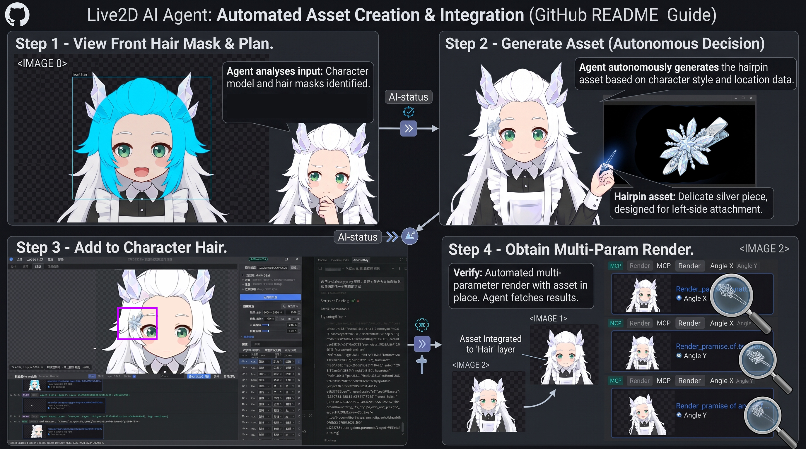

# PSD2Live User Guide

[中文](../../zh/guide/USER_GUIDE.md) | [日本語](../../ja/guide/USER_GUIDE.md)

PSD2Live provides a desktop GUI, an automated Command Line Interface (CLI), and a local MCP workspace for external AI hosts. This guide covers the workspace tabs, independent log dock, Agent connection and recovery, viewport interaction, parameter tuning, and export.

---

## Table of Contents

- [Prerequisites](#prerequisites)
- [Launch Methods](#launch-methods)
- [Desktop GUI Overview](#desktop-gui-overview)
- [Workspace Tabs](#workspace-tabs)
  - [1. Edit Tab](#1-edit-tab)
  - [2. Preview Tab](#2-preview-tab)
  - [3. History Tab](#3-history-tab)
- [Independent Log Dock](#independent-log-dock)
- [Connecting an AI Agent / MCP Host](#connecting-an-ai-agent--mcp-host)
- [Canvas Viewport & Shortcuts](#canvas-viewport--shortcuts)
- [Inspector Panels](#inspector-panels)
  - [Export Control Section](#export-control-section)
  - [Model Settings Section](#model-settings-section)
  - [Layers Table](#layers-table)
  - [Parameters Panel](#parameters-panel)
- [End-to-End Workflow](#end-to-end-workflow)
- [CLI Reference](#cli-reference)
- [Troubleshooting & FAQ](#troubleshooting--faq)

---

## Prerequisites

- **OS**: Windows 10/11 x64 (recommended for official Cubism 5-r.5 native rendering; Linux / macOS automatically fall back to CPU software rasterization).
- **Java Runtime**: JDK 21 or higher (JetBrains Runtime / OpenJDK 21+).
- **Input File**: Layered `.psd` file (8-bit RGB color mode, alpha channel transparency).

---

## Launch Methods

### 1. Windows Quick Launch
Double-click `run-gui.bat` in the repository root.

### 2. Gradle Command Line
```powershell
# Windows (PowerShell)
.\gradlew.bat run

# Linux / macOS (Bash)
./gradlew run
```

---

## Desktop GUI Overview

The main window is structured as **Left Workspace + Right Inspector + Independent Bottom Log Dock and Status Bar**.

- **Menu Bar**:
  - **File**: `Open PSD...` (`Ctrl + O`), `Reanalyze` (`Ctrl + R`), `Open Output Directory`, `Generate & Export` (`Ctrl + G`), `Export To...` (`Ctrl + Shift + G`), `Exit`.
  - **Language**: Instant switching between Simplified Chinese (`zh`), English (`en`), and Japanese (`ja`).
  - **View**: Tab management, UI & font scale. The current tab's canvas options live in the `View ▾` menu at the right of the tab strip.
  - **Settings**: `Preferences & Settings…` (`Ctrl + ,`) — scale & display, language, canvas interaction, shortcuts and environment.
  - **Tools**: `Texture Upscale…` (`Ctrl + U`), **MCP** (`MCP Connection & Setup…`).
  - **Help**: Version and license notices.
- **Split Pane Divider**: Drag to adjust the Workspace/Inspector ratio within `25% ~ 85%`.

---

## Workspace Tabs

The left workspace is a browser-style tab strip: two fixed tabs — **Edit** and **Preview** — plus any number of added tabs.

- **Fixed and added tabs**: `Edit` and `Preview` are pinned and cannot be closed. `+` adds an Edit, Preview, or History tab; added tabs show a close button (`✕`). `Ctrl+T` adds an Edit tab, `Ctrl+Shift+T` a Preview tab, `Ctrl+H` opens the History tab, `Ctrl+W` closes the current tab, `Ctrl+Tab` / `Ctrl+1…9` switch tabs.
- **Per-tab view options**: Every canvas tab keeps its own texture / mesh wireframe / warp / deform-path / annotation toggles *and* its own canvas zoom and pan. These options have a single home: the `View ▾` menu at the right of the tab strip (the title-bar View menu no longer repeats them). A dot on that button means the tab differs from the defaults, and `Reset Current Tab View Options` restores them. Two Preview tabs can therefore hold different overlays and camera positions at the same time. The deform-path toggles are listed on Edit tabs only, because path guides never paint on a Preview canvas.
- **Right-click a tab** to duplicate or close it; `View → Tabs` exposes the same commands with their shortcuts. The close button only appears on the current or hovered tab.

### 1. Edit Tab
- **Deformer & Drawable Tree**: Displays the full deformer hierarchy (`BodyXY` -> `BodyZ_Breath` -> `HeadRotation` -> `HeadContainer` -> `FaceNinePose` -> Feature Warps -> ArtMeshes).
- **VS Code Style Tree Guides**: Clean indentation guide lines with expand/collapse arrows.
- **Ear Tab Collapse**: Click the collapse button in the header to minimize the hierarchy tree into a compact side tab, maximizing canvas area.
- **Opaque Canvas**: Artwork always renders at its own opacity instead of a global semi-transparency. Use `Selected only` or `Dim unselected` on that tab when you need to focus, and the overlays draw on top.
- **Idle guides fade out**: With no layer or deformer selected, the warp lattices and rotation-deformer boxes render faded instead of covering the artwork. Selecting something brings its own guides back to full strength; turn the tab's `Dim unselected` off to keep everything bright.
- **Path guides follow the selection**: A deform path is only drawn while the part it deforms — or that part's deformer — is selected, and only on an Edit tab. With nothing selected the canvas shows no paths at all, hovering a part in the tree previews its path, and the Preview tab always renders clean artwork.
- **Deformer Warp option**: an Edit tab enables `Deformer Warp` by default (so the rig lattice is still visible), and that option now really governs the view — turn it off for artwork plus mesh wireframe only.
- **Mesh Wireframe**: Enable `Mesh Wireframe` in that tab's `View ▾` menu to overlay the adaptive Delaunay triangulation with a dark halo (turn the texture off for a pure wireframe). The bottom-left badge then reports drawable, vertex, and triangle counts.

### 2. Preview Tab
- **Native Cubism 5-r.5 Engine (Optional)**: On Windows x86-64, supports offscreen OpenGL rendering via JNA using the official Live2D Cubism Core & Framework library (`live2d_renderer.dll`) to achieve **100% faithful rendering and physical dynamics parity with the official runtime (Ground Truth)**.
  - *Note: To comply with Live2D's Proprietary License, this repository does NOT include or redistribute official SDK binaries. See [Live2D Cubism SDK Configuration Guide](CUBISM_SDK_SETUP.md) for setup instructions.*
- **Built-in Pure CPU Software Rasterizer**: Automatically active when the official SDK is absent or on non-Windows platforms (macOS / Linux); provides 100% out-of-the-box preview and slider inspection without any manual configuration.
- **Interactive Features**: Real-time mouse gaze tracking, 6-second breathing/blink idle loop, and blink-driven eye jelly dynamics.
- **Status Badge**: Bottom-left pill displays current zoom percentage, underlying engine type (`Native Cubism` or `Software Fallback`), and physics state.

### 3. History Tab
- **Append-only Branch Tree**: Shows immutable nodes created by the system, user, and Agent. A green `HEAD` badge marks the active workspace version; editing after restoring an older node creates a new branch without deleting the old future.
- **Navigation**: Drag the canvas to pan, use `-` / `+` to zoom or reset the view, and search summaries, node IDs, or actors.
- **Inspect and Restore**: Select a node to view its ID, parent, revision hash, actor, and timestamp. “Restore to this node” rebuilds its editable assets and rig without deleting any history node.

## Independent Log Dock

Logs remain visible below every workspace tab instead of occupying a tab of their own:

- Click the header chevron to collapse or expand it; drag its top edge to resize it between `80` and `450 px`.
- Filter by All, System, Agent/MCP, or Images Only; search messages, tags, and details; and toggle auto-scroll. The header reports both log and image counts.
- Rendered Views and imported assets appear as inline thumbnails. Click one to open a larger checkerboard preview with dimensions, file size, and a Copy Image action.
- Clear affects only the current UI log. Copy Log copies the filtered text and does not modify history or task records.

## Connecting an AI Agent / MCP Host

<p align="center">
  
  <br>
  <em>Inspect model Views, generate through the host-native image tool, import a layer, and verify multiple parameter poses</em>
</p>

At startup, PSD2Live exposes a bearer-authenticated Streamable HTTP MCP at `127.0.0.1:23871/mcp`. Keep the app running. Treat the token as local workspace write access; do not publish or commit it.

1. Open **Tools → MCP → MCP Connection & Prompts…**.
2. On Connection Config, copy the matching configuration and prefer native Streamable HTTP:
   - ChatGPT desktop / Codex: merge the HTTP TOML into `~/.codex/config.toml`, or `.codex/config.toml` in a trusted project, restart the client, and check `/mcp`.
   - Gemini / Antigravity: merge the `psd2live` HTTP JSON entry into `~/.gemini/config/mcp_config.json`, then refresh MCP Servers.
   - Other HTTP hosts: use the displayed endpoint with `Authorization: Bearer <token>`. Do not switch to the legacy `/sse` endpoint.
   - Stdio-only hosts: copy the Stdio JSON and run the repository-root `mcp_proxy.py` with Python 3. The bridge reads `PSD2LIVE_MCP_ENDPOINT` (defaulting to the address above), `PSD2LIVE_MCP_TOKEN`, and optional `PSD2LIVE_MCP_TIMEOUT`. On Windows, it can fall back to the credential saved by PSD2Live.
3. The Installation Prompt tab contains the complete setup prompt. List tools after connecting, then call `inspect` with `scope: project` for the project and history HEAD summary.

Current tools include:

| Capability | Tools and branches |
| :--- | :--- |
| Project inspection | `inspect`: `scope` is `project`/`objects`/`layers`/`parameters`/`physics`; or `target:"kind:id"` for one object's direct parameter axes, channels and parent chain; also `query`, `offset`, `limit` (1–64) |
| Local deformation | `deform`: `state` + `changes` (1–128), each with `target`, `key`, `operations` (1–16) and optional `selection`; operations are `translate`/`scale`/`rotate`/`arc`/`curve`/`landmarks`, `selection` accepts `rect`/`center`+`radius`/`line`+`radius`, plus `feather` and `hardness` |
| Keyforms | `form`: `state` + `changes` (1–128), `op` is `seed`/`copy`/`set`/`delete`; writes channels or a Rotation form, never mesh point arrays |
| Independent Warp | `rig`: `state`, `name`, `targets` (1–64 meshes sharing one Warp parent); creates a fitted independent Warp and returns the new `target` |
| Model Views | `view`: `mode` is `model`/`layer`/`context`/`coverage`/`poses`/`motion`/`compare`; `poses` returns one labeled sheet, `motion` samples the timeline, `compare` diffs across history nodes |
| Parameter definitions | `parameter`: `mode` is `create`/`update` |
| Transparent assets and layers | `asset`: `mode` is `create`/`split`/`reference`/`import`/`register`/`preview`/`add`/`place`/`finalize`/`inspect`/`reprocess`/`remove` |
| Physics | `physics`: `mode` is `put` |
| Structure and appearance | `appearance`: `state` + `edits`, one ordered edit covering rename, show/hide and reparenting |
| Saving and history | `revision`: `mode` is `save`/`checkpoint`/`list`/`restore` |

Every project edit that advances `HEAD` must carry the current `state`; use the returned node as the base for the next edit. Staging a PNG does not move `HEAD`. After a timeout, disconnect, or expired session, the commit state may be unknown. Reconnect and call `inspect` (`scope: project`) and `revision` (`list`) to check the commit state and the affected objects before deciding whether to retry. The Stdio bridge automatically retries only safe read calls, never project edits.

PNG Views retain reversible pixel/canvas mappings. Use reference_id with `asset` (`register`) for placement, or the legacy spatial_reference_id path. Artwork may use original pixels, SVG, painting or available image tools. Omit solid_background to preserve native alpha; declare an actual matte explicitly when removal is desired. See the [MCP interface contract](../../zh/agent/MCP_AUTHORING.md).

History, tasks, spatial references, and SHA-256-deduplicated RGBA assets are persistent. The default Windows store is `%LOCALAPPDATA%/PSD2Live/agent-workspaces`; override it with the JVM property `psd2live.agent.store`. Reloading a PSD with the same normalized path and file signature restores its last `HEAD`.

---

## Canvas Viewport & Shortcuts

| Action | Shortcut / Mouse Gesture | Description |
| :--- | :--- | :--- |
| **Zoom** | Mouse Wheel (`Scroll`) | Cursor-centered zoom (`0.05x` ~ `64.0x`) |
| **Pan** | Middle Click Drag / Left Click Blank Drag | Canvas translation |
| **Center & Fit** | `F` / `Home` / `0` | Resets camera to center and fit the entire model |
| **Hit Select** | Left Click on Mesh | Selects clicked layer with tree and table synchronization |
| **Open PSD** | `Ctrl + O` | File open dialog |
| **Reanalyze** | `Ctrl + R` | Reloads and re-evaluates current PSD |
| **Generate & Export** | `Ctrl + G` | Executes full pipeline export |
| **Export To...** | `Ctrl + Shift + G` | Selects target folder and exports |

---

### Shortcuts and Presets

Every shortcut listed above, and every other shortcut in the application, can be changed under **Settings -> Shortcuts**: click a key cell, then press the new combination. `Esc` cancels. An action can carry several alternative keys, or none at all (an unbound command stays reachable from the menu). If the combination is already taken, the panel refuses it and names the action that owns it, so a chord can never end up bound but dead.

Three presets ship with the application. Switching a preset replaces every custom binding:

| Preset | Description |
| :--- | :--- |
| **Photoshop Style** (default) | The traditional layout this guide documents. |
| **Blender Style** | `G` to transform, `Tab` to toggle mesh editing, `B`/`C` to select, `V`/`S` for brushes, `Ctrl+PageUp/Down` for tabs. |
| **Live2D Cubism Style** | Adds `A` for the select tool, `P` for the deform path, `Ctrl+E` for mesh editing and `Shift+F` to fit the work area on top of the Photoshop set. |

Press `F1` and open the Keyboard Shortcuts tab for the full list, including the file, edit, tab and view commands. That list is generated from the current bindings, so it cannot drift from what the application actually does. "Reset Defaults" also returns the shortcuts to the Photoshop preset.

---

## Inspector Panels

### Export Control Section
- Output directory path input and folder browse button.
- Toggle checkboxes: `Physics`, `CMO3`, `MOC3`.
- Primary action: `Generate & Export`.

### Model Settings Section
- **Atlas Size**: Presets (`1024`, `2048`, `4096`, `8192`, `16384`) + numeric spinner (`256 ~ 16384`).
- **Mesh Spacing**: Spacing slider (`16 ~ 128 px`) with `32`, `64`, `96` quick chips.
- **Head Strength**: Multiplier for 9-pose facial lattice and feature deformation (`0.0x ~ 4.0x`).
- **Body Strength**: Multiplier for torso kinematics and chest breathing (`0.0x ~ 4.0x`).
- **Advanced Settings**: Texture padding (`0 ~ 32 px`, default `2px`) and Alpha threshold (`0 ~ 255`, default `8`).

### Layers Table
- Summary statistics (Visible / Total, Recognized, Unknown).
- Batch actions: `Show All`, `Hide All`, `Invert`.
- Table columns: Eye icon toggle, Layer name & index, Semantic dropdown (31 tags), Side dropdown (`NONE`/`LEFT`/`RIGHT`).

### Parameters Panel
- Real-time search filter by parameter name or ID.
- Global controls: Animation Play/Pause, Mouse tracking toggle, Unlock All, Reset All.
- Parameter rows: Pin lock button, display name + ID, value slider, precision spinner, single reset button.

---

## End-to-End Workflow

1. **Import**: Drag and drop a layered `.psd` file into the application window.
2. **Review & Tune**: Confirm semantic assignments in the Layers Table; check mesh triangulation from the Edit tab's `View ▾` menu (`Mesh Wireframe`); test mouse tracking in a Preview tab.
3. **Optional Agent Refinement**: Connect an MCP host and use model Views for parameter, keyform, or asset edits. Confirm the active `HEAD` in History; restoring an older node and editing from it creates a branch.
4. **Export**: Set target directory and format toggles; click `Generate & Export` (`Ctrl+G`) to produce model files.

---

## CLI Reference

```powershell
# Basic export
.\gradlew.bat run --args="--input D:/models/character.psd --output D:/dist/character"

# Advanced configuration
.\gradlew.bat run --args="--input D:/models/character.psd --output D:/dist/character --atlas 8192 --mesh-spacing 48 --head-strength 1.2 --lang en"
```

| Option | Type | Default | Description |
| :--- | :---: | :---: | :--- |
| `--input <path>` | Path | *(Required)* | Input PSD file path |
| `--output <path>` | Path | `PSD_DIR/psd2live-output` | Destination output directory |
| `--lang <zh\|en\|ja>` | String | System Locale | UI and log language (`zh` / `en` / `ja`) |
| `--atlas <size>` | Int | `4096` | Texture atlas square dimension (`256 ~ 16384`) |
| `--mesh-spacing <px>` | Int | `64` | Base mesh sampling spacing in pixels |
| `--head-strength <val>` | Float | `1.0` | 9-pose facial deformer strength multiplier |
| `--body-strength <val>` | Float | `1.0` | Body kinematics and breath strength multiplier |
| `--no-physics` | Flag | `false` | Disables `physics3.json` and CMO3 physics injection |
| `--no-cmo3` | Flag | `false` | Skips `.cmo3` project export |
| `--no-moc3` | Flag | `false` | Skips `.moc3` runtime export |
| `--help` / `-h` | Flag | - | Prints CLI help text |

---

## Troubleshooting & FAQ

- **Q: The Agent cannot connect, or reconnecting reports an expired session.**
  A: Keep PSD2Live running and recopy the current endpoint and token from the connection dialog. Native HTTP hosts must use `/mcp`, not `/sse`; Stdio hosts should run `mcp_proxy.py`. Reinitialize after session expiry and read `inspect` (`scope: project`) plus `revision` (`list`) before resuming mutations.
- **Q: Does restoring an old history node delete later edits?**
  A: No. Nodes are append-only and immutable. Restore moves only the workspace `HEAD`; editing from that node creates a new branch while the original future remains available.

- **Q: Java runtime version error on launch?**
  A: Ensure JDK 21+ is installed and `JAVA_HOME` is configured.
- **Q: Why are certain layers labeled as unknown?**
  A: Layers not matching known naming patterns are classified as unknown and assigned to head or body containers by spatial position. You can manually assign semantics in the Layers Table.
- **Q: Why does the eyelash distort or tear on blink closure?**
  A: Check if lower eyelashes or complete lower lid contours are included in the `eyelash` layer. The blink algorithm pulls the alpha-weighted centerline downward into a U-shape; merged lower lashes drag the centroid to the eyeball center and cause collision tearing. **Eyelashes must strictly be authored on the upper half of the eye**. Move lower lashes to `facedetail` or an independent static layer.
- **Q: Why does the mouth look blurred or muddy when closed?**
  A: The `mouth` layer must be drawn in a **fully open state**, and **crisp outline strokes on the lips are strongly recommended**. Upon closure, the mesh is centripetally compressed; clean outline strokes merge neatly into a sharp seam, whereas unbordered soft paint easily blurs or blends into adjacent skin.
- **Q: If the source artwork has a tilted head, is it snapped upright? How are rotation ranges computed?**
  A: The head is not forcibly straightened. The pipeline estimates the authored tilt (`initialAngleZ`) from facial baselines, aligning `DeformHeadRotation` to this tilt. The 9-pose facial lattice and `ParamAngleZ` ($\pm 30^\circ$) **calibrate their rotation limits around this initial angle as the neutral origin**. Keep initial head roll within natural limits ($\pm 25^\circ$).
- **Q: Are heavily reclining, sideways, or horizontal character poses supported?**
  A: **Excessive body tilt is not supported**. Torso kinematics (`ParamBodyAngleX/Y`) and chest breathing (`ParamBreath`) are formulated on a vertical canvas reference frame. Severe body tilts cause breathing to deform sideways and induce shear tearing under torso rotation. Keep character bodies predominantly upright.
- **Q: Why does the pupil stay visible when the eye closes?**
  A: Iris layers are clipped by eye-white (`eyewhite`). Verify that an `eyewhite` layer is present so eye closure shrinks the clipping mask.
- **Q: Exported `.cmo3` prompts about missing source art in Cubism Editor?**
  A: The base meshes are constructed from the generated atlas slices (`MissingSourceArt` is expected and normal). Keyforms, deformers, and parameters remain fully editable.
- **Q: Why does the Preview viewport show "Software Rasterizer"? How do I enable official runtime consistency verification?**
  A: PSD2Live strictly complies with open source licensing and Live2D's Proprietary License terms; **proprietary Live2D SDK binaries are NOT distributed with the source or releases**. Without the SDK, the application smoothly uses the built-in CPU software rasterizer (full model analysis, rigging, and `.cmo3`/`.moc3` exports are completely unaffected). If you want to enable official shader rendering to achieve **100% pixel-perfect parity with official game clients / Cubism Viewer (Ground Truth)**, please follow the [Live2D Cubism SDK Configuration Guide](CUBISM_SDK_SETUP.md).

## Portable projects and history

After importing a PSD (Ctrl+Shift+O), choose a custom folder, the PSD folder, or `projects` in the application installation. Confirming creates a `.psd2live` file immediately. Unwritable locations report an error; existing files require an overwrite choice. Cancel leaves an unsaved workspace.

Use Ctrl+O to open a project, Ctrl+S to save, and Ctrl+Shift+S to save as. The unencrypted ZIP contains the original PSD, images, all history branches, rig/configuration, Agent records and workspace UI state. Transfer the single file to move the project. Saving is separate from Cubism export; closing or switching prompts about unsaved changes.

Each save immediately appends a history node, even when unchanged. Failed writes preserve the old file; edits during saving stay dirty. The history UI supports titles, notes, hiding/showing branches and checkout. Hidden branches retain their data. Ctrl+Z undoes; Ctrl+Y redoes or opens branch selection. MCP exposes `revision` (`save`/`checkpoint`) and records each successful model modification. See [the format reference](../spec/PROJECT_FORMAT.md).
