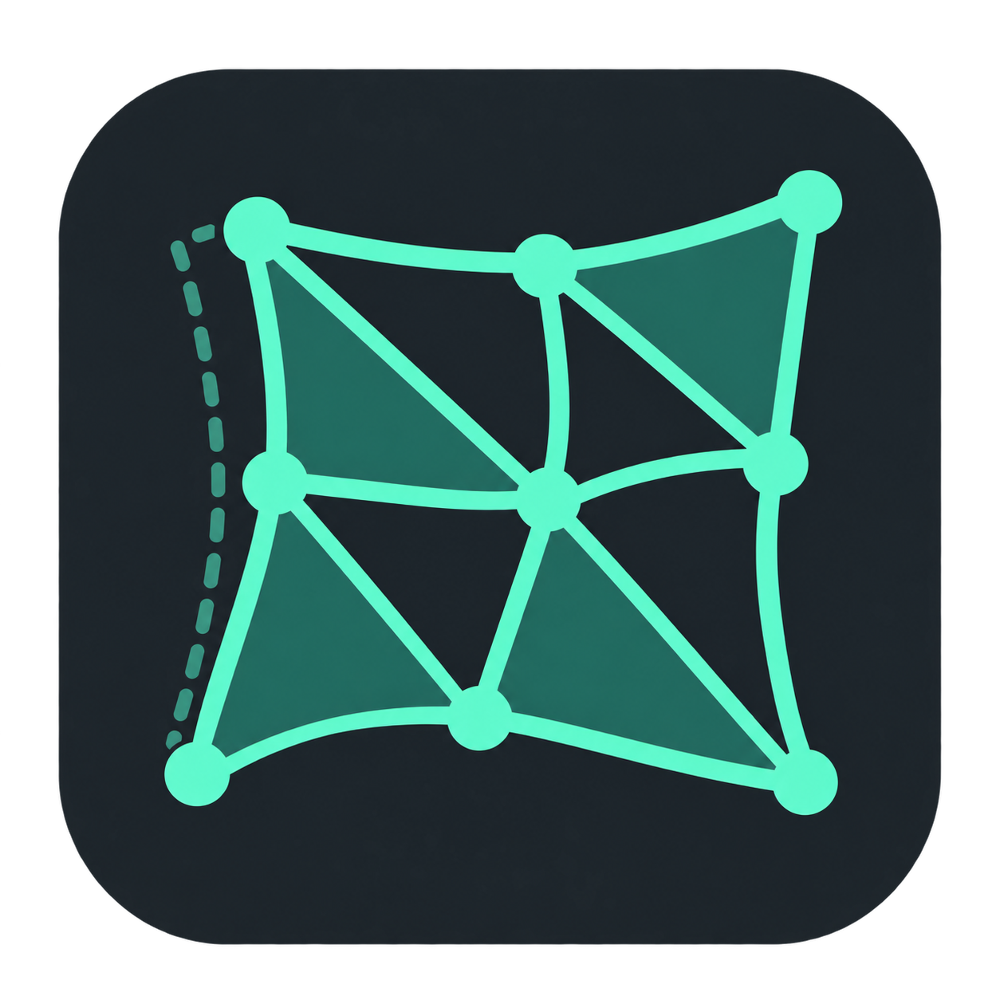
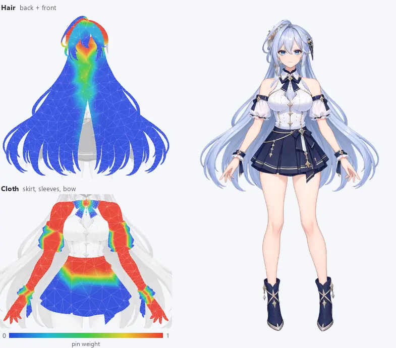

<div align="center">



# PSD2Live

**オープンソースの 2D キャラクターリギング・アニメーションエディタ**

レイヤー分けした PSD から動く初版を自動で組み立て、1 つのワークスペースで形の調整、ボーン、物理とシミュレーション、アニメーションまで行い、<br>
Cubism、VTube Studio、独自ランタイム、Web、ゲームエンジン、動画へ書き出せます。

[](https://github.com/tsunehimatoi/psd2live/releases/latest)
[](#ライセンス)
[](#ダウンロード)
[](#書き出しと再生)
[](#agent-との連携mcp)

[中文](../../README.md) · [English](../en/README.md) · [한국어](../ko/README.md)

[ダウンロード](https://github.com/tsunehimatoi/psd2live/releases/latest) · [はじめに](#はじめに) · [ドキュメント](../README.md) · [更新履歴](../zh/CHANGELOG.md) · [ロードマップ](../zh/ROADMAP.md)

</div>

PSD2Live は 2D キャラクターリギングの一貫したツールチェーンです。レイヤー分けした PSD からメッシュ、デフォーマ、パラメータ、モーション、物理を自動生成し、デスクトップエディタで編集を続け、Cubism、独自ランタイム p2lrt、各種汎用形式へコンパイルします。独自の評価エンジン、プロジェクト形式、分岐履歴を持ち、ワンクリック生成は出発点にすぎません。すべての編集は再生可能な記録として保存され、再生成後も有効です。

> [!NOTE]
> Cubism は主要な書き出し先であり、機能の上限ではありません。ボーンや 2D シミュレーションなど Cubism にない機能は、書き出し時にネイティブのデフォーマ、パラメータ、キーフォーム、振り子へベイクされます。納品したモデルは PSD2Live に依存しません。

## こんな方に

| あなたが | PSD2Live でできること |
| --- | --- |
| **初心者で、とにかく動くモデルがほしい** | 命名規則に沿ってレイヤーを分け、読み込んでプリセットを選ぶだけで、待機・まばたき・うなずき・髪の物理を備えたモデルが数分ででき、VTube Studio や Web へそのまま書き出せます |
| **モデリングに不慣れで、AI に任せたい** | ローカル MCP サーバーで Claude Code、Codex などの Agent がプロジェクトを直接読み書きできます。各操作は同じ履歴に入り、エディタで確認・取り消しできます |
| **経験者で、繰り返し作業を省きたい** | メッシュ、デフォーマチェーン、顔パラメータ、物理をワンクリックで生成し、キャンバスで細部を詰められます。手作業の修正は再生可能な記録として保存され、再生成後も有効です |
| **オープンソースの代替が必要** | エディタ、エンジン、プロジェクト形式はすべてオープンソース。公式 SDK なしで編集、プレビュー、`.moc3` / `.cmo3` の書き出しができます |
| **Cubism の機能では物足りない** | ボーンと IK、2D の布・髪シミュレーション、自動スケルトンなど Cubism にない道具を、書き出し時にネイティブ構造へベイクします |
| **自分のプログラムにキャラクターを組み込みたい** | オープンソースの Rust ランタイム p2lrt は C / C++、.NET、Android、Web、Godot に組み込め、ソフトウェアレンダラーも内蔵。動画、連番画像、Spine、glTF（実験的）にも書き出せます |

## 主な機能

| 分野 | 機能 |
| --- | --- |
| **自動生成** | 中 / 英 / 日 / 韓のレイヤー名を認識。適応メッシュ、頭部と体のデフォーマチェーン、顔パラメータ、待機 / まばたき / うなずき / 首振りのモーション、髪の物理と布シミュレーション |
| **キャンバス編集** | 選択、変形、編集、シミュレーション、ボーン、ペイント、プレビューの 7 モード。変形ブラシ、メッシュトポロジー編集、レイヤー分割と前後分割、Warp / Rotation、Glue |
| **ボーンとシミュレーション** | 自動スケルトン、FK / IK、プリセットモーション、XPBD による布と髪のシミュレーション。すべて Cubism のネイティブ構造へベイク |
| **アニメーションと物理** | タイムライン、キーフレーム、カーブ。振り子を視覚的に編集でき、評価は Cubism Native Framework と一致 |
| **テクスチャ** | アトラス配置、レイヤーごとのテクスチャ密度、任意の 2× / 4× 高解像度化 |
| **コンパイルと書き出し** | すべての書き出し先を 1 つの中立リグ IR からコンパイルし、毎回損失レポートを出力 |
| **p2lrt ランタイム** | オープンソースの Rust ランタイム：C ABI、ソフトウェアレンダラー、WebAssembly の Web プレイヤー、Godot 4 ノード、.NET と Android 向けビルド。エディタの評価とポーズ単位で一致 |
| **Agent** | 180 を超える公開操作を持つローカル MCP サーバー。エディタと編集コマンド・履歴を共有し、アトミックな一括編集と試行実行に対応 |

## 動作検証

以下の画像はリポジトリ内の 2 つのサンプル PSD によるものです（膝のテストと体の動きのアニメーションは、別の脚の長いキャラクターのプロジェクトを使用）。どちらのサンプルも読み込み時に「フル」プリセットを選び、手作業の修正は加えていません。髪とスカートはベイク済みシミュレーションで動きます。テスト画像は開発ツールとコマンドラインの書き出し結果から、エディタの画面は実際のエディタウィンドウの描画フレームから作成しています。

### エディタ

<table>
<tr>
<td width="50%" valign="top"><br><sub><b>アニメーション</b>：モーション一覧、タイムラインとカーブ編集。プレビューとパラメータが再生位置に追従</sub></td>
<td width="50%" valign="top"><br><sub><b>ボーン</b>：キャンバス上で関節を調整し、FK / IK でポーズを付ける</sub></td>
</tr>
<tr>
<td width="50%" valign="top"><br><sub><b>テクスチャ</b>：アトラス上でタイルを配置し、レイヤーごとにテクスチャ密度を設定</sub></td>
<td width="50%" valign="top"><br><sub><b>読み込み</b>：モデルプリセットを選び、1 枚に描かれた左右のパーツをメッシュで分割</sub></td>
</tr>
</table>

### 物理とシミュレーション

体の角度を上下、左右、楕円の順に 1 周ずつ動かしています。髪、スカート、袖、リボンはベイク済みシミュレーションで追従し、上下動や向きの変化に遅れて揺れ、止まったあとに揺り戻します。左は各部位のピンウェイトで、1 は体に追従、0 は自由、中間値は比例して引き寄せます。

<p align="center"></p>

<p align="center"></p>

### 自動リギング

読み込むだけで頭部と顔のリグが揃います。顔の Warp、パーツの平面、髪と体の追従は、生成された 1 本のデフォーマチェーンで駆動されます。


### 自動メッシュトポロジー

メッシュはテクスチャの輪郭から生成され、穴、細いブリッジ、先端はそれぞれ独立した輪郭ループになります。設定は全体とレイヤー単位で調整できます。


<table>
<tr>
<td width="50%" valign="top"><br><sub><b>実素材</b>：サンプルキャラクターの長い巻き髪。輪郭が巻き毛 1 本ずつに沿う</sub></td>
<td width="50%" valign="top"><br><sub><b>頂点ウェイト</b>：シミュレーションモードで同じメッシュ上に固定ウェイトを表示・ペイント（赤は固定、青は自由）</sub></td>
</tr>
</table>

### 自動スケルトン

レイヤーのタグから胴体、手足、尻尾を推定し、ボーンをネイティブのデフォーマとキーフォームへベイクします。膝と肘は人の関節に沿って形づくられ、外側は膝頭が丸く出て内側は折りたたまれ、太ももの剛体部分はすねと一緒にずれません。同じプリセットモーションが異なる体型に合います。


### p2lrt ランタイムの一致性

Rust ランタイムでエディタの基準ポーズと軌跡を 1 つずつ再生しています。形状、物理、シミュレーションはすべて合格し、4 種類のファイルエンコードから同じ結果が得られます。


## Cubism との関係

PSD2Live は Cubism Editor や SDK なしで動作し、Cubism の形式とは互換性を保ちます。各機能は Cubism に取り込めるかどうかで 3 段階に分かれます。

| 区分 | 意味 | 例 |
| :---: | --- | --- |
| **無損失** | Cubism がネイティブに対応、または編集作業にのみ影響 | メッシュ、デフォーマ、パラメータ、物理、モーション。ブラシ、分割、自動生成 |
| **ベイク** | Cubism にはないが、キーフォーム、パラメータ、振り子へベイクできる | ボーンと IK、布 / 髪のシミュレーション、揺れの生成 |
| **ランタイム専用** | ベイクできず、独自ランタイム、Web、Godot、ラスター書き出しでのみ有効 | 予定している動的ライティングとスタイライズ描画。[ロードマップ](../zh/ROADMAP.md)（中国語）を参照 |

`.moc3` / `.cmo3` の書き出しでは、後ろの 2 区分は対象バージョン（Cubism 3.0 – 5.3）に合わせて変換され、損失レポートに記録されます。

## ダウンロード

最新版は [Releases](https://github.com/tsunehimatoi/psd2live/releases/latest) から入手できます。変更点は[更新履歴](../zh/CHANGELOG.md)（中国語）を参照してください。

| プラットフォーム | パッケージ | 説明 |
| --- | --- | --- |
| Windows 10 / 11 x64 | ポータブル ZIP、EXE | Java ランタイム同梱。展開またはインストールしてそのまま起動。それぞれ ffmpeg 同梱の `-ffmpeg` 版あり |
| Windows 11 ARM64 | ポータブル ZIP、EXE | Java ランタイム同梱。Cubism ネイティブプレビューなし（Live2D がこのプラットフォーム向けの Cubism Core を提供していないため）、プレビューは PSD2Live ランタイムを使用 |
| Linux x86_64 / arm64 | Deb | ランタイムと Cubism ネイティブプレビュー同梱（arm64 は Live2D の実験版）。X11 / GLX が必要（XWayland で可） |
| macOS ほか | パッケージなし | JDK 21 をインストールして[ソースから実行](#ソースからのビルド) |

<details>
<summary>アップグレード、アンインストール、Linux について</summary>

- **アップグレード**：インストール済みのフォルダへ上書きされ、パスを選び直す必要はありません。3.1.x 以前の EXE / MSI 版は自動で削除され、同じフォルダを引き継ぎます。
- **アンインストール**：設定とワークスペースのデータは既定で残ります。アンインストール時に PSD2Live のデータも削除するか確認され、「はい」を選ぶと一緒に削除されます。保存したプロジェクトとインストールフォルダに置いたファイルは常に残ります。
- **Linux**：ネイティブプレビューは XWayland のない純粋な Wayland と musl（Alpine など）に対応しておらず、これらの環境では内蔵レンダラーに切り替わります。[Cubism ネイティブプレビュー](guide/CUBISM_SDK_SETUP.md)を参照してください。

</details>

## はじめに

1. **PSD を読み込む**：**ファイル → インポート → PSD から新規プロジェクト…**（`Ctrl+Shift+O`）、またはウィンドウへドラッグします。「スタート」画面でモデルプリセット（最小 / 標準 / フル）を選び、メッシュごとに分割するレイヤー（1 枚に描かれた左右の脚など）にチェックを入れます。
2. **判定結果を確認**：「レイヤー」表でパーツの種類、左右、差分設定を確認し、誤りはその場で修正します。
3. **プレビューと調整**：「プレビュー」ワークスペースで動きと物理を確認し、必要に応じて編集・リギング・アニメーション・物理演算・テクスチャの各ワークスペースで調整します。
4. **保存と書き出し**：`Ctrl+S` で `.psd2live` を保存し、`Ctrl+G` で `.moc3` / `.cmo3` を書き出します。その他の形式は **ファイル → 形式を指定して書き出し** にあります。

> [!TIP]
> **初めての方は「ヘルプ → チュートリアル…」（`F1`）を開いてください。** 対応する操作箇所を強調表示し、現在のキー設定で案内します。初心者コース（18 講座）と Cubism 経験者コース（13 講座）があり、[操作早見表](guide/USER_GUIDE.md)はその文字版です。

### 素材の準備

自動生成の品質は主に PSD のレイヤー分けで決まります。

- 白目、虹彩、上まつげを分け、まぶたに隠れる部分の虹彩も残す。
- 口を開けた素材を用意する（または上の歯、下の歯、舌を分ける）。
- 前髪と後ろ髪を分け、隠れる部分に余白を残す。
- 体はおおむね直立させ、レイヤー効果と文字は事前にラスタライズする。

命名表の全体は [PSD の準備と命名](spec/PSD_LAYER_SPEC.md)にあります。判定できなかったレイヤーも残り、画面で種類を指定できます。

## 書き出しと再生

| 書き出し先 | 出力 |
| --- | --- |
| **Cubism Editor** | `.cmo3` モデルプロジェクト。公式エディタで確認・仕上げ |
| **Cubism ランタイム** | `.model3.json` + `.moc3` とテクスチャ、物理、モーションなどのファイル一式。`.model3.json` から読み込み |
| **VTube Studio** | `.moc3` 一式と `.vtube.json`。フェイストラッキングを標準パラメータに割り当て、モーションごとにホットキー |
| **自分のプログラム / エンジン / Web** | C / C++、.NET、Unity、Godot、Android 向けの `.p2lrt` モデル、またはブラウザで開ける WebGL 再生ページ |
| **画像と動画** | PNG 連番、スプライトシート、GIF。APNG、アニメーション WebP、MP4、WebM、ProRes 4444（ffmpeg 経由） |
| **PSD** | 現在のポーズのレイヤー付き PSD、または生成レイヤーを含むソース PSD |
| **実験的** | Spine 4.2、DragonBones 5.5、glTF 2.0。コマンドラインからのみ |

`Ctrl+G` で Cubism 形式を書き出し、対象バージョンは 3.0 – 5.3（既定 5.0）から選べます。その他は **ファイル → 形式を指定して書き出し** にあります。[書き出しターゲット](../zh/spec/EXPORT_TARGETS.md)（中国語）を参照してください。

> [!IMPORTANT]
> 作業を続けるには `.psd2live` プロジェクトを保存してください。元の PSD、素材、設定、すべての編集と履歴の分岐を含みます。書き出し時に付く `.psd2live.json` は診断レポートにすぎません。書き出しに成功しても全ランタイムで同じ見た目になるとは限らないため、納品前に対象のエディタと実行環境で確認してください。対応範囲は[ランタイムと書き出しの境界](../zh/spec/RUNTIME_EXPORT_ARCHITECTURE_AND_GAPS.md)（中国語）を参照してください。

内蔵レンダラーは公式 SDK なしで動作します。[Cubism ネイティブプレビュー](guide/CUBISM_SDK_SETUP.md)は任意で、公式ランタイムの描画と物理との比較に使えます。

## p2lrt ランタイム

[`runtime/`](../../runtime/) は書き出した `.p2lrt` モデルを再生するオープンソース（MIT）の Rust ランタイムです。エディタのソフトウェアプレビューも同じライブラリで評価しています。

| 項目 | 説明 |
| --- | --- |
| **コア評価** | Cubism と同等の Warp / Rotation 変形、ブレンドシェイプ、Glue、パーツと描画順、不透明度と色チャンネル。エディタの評価とポーズ単位で一致 |
| **物理とモーション** | physics3.json の意味に沿った振り子物理（風と安定化を含む）。最大 16 層のモーションを優先度で重ね、イベントとパーツ / 全体の不透明度カーブに対応、フェードは Cubism と同じ。複数の表情を同時に適用 |
| **手続き的な動作** | まばたき、呼吸、視線追従、口パク（音声で駆動可能）。ホスト層でモーションの上に外部パラメータ（フェイストラッキングなど）を重ねられる |
| **高度な拡張** | 任意で有効化：関節のランタイムスキニング、正確なリンク、XPBD によるリアルタイムの布・髪と衝突。無効時の結果はコア評価とビット単位で一致 |
| **描画** | ヘッダーの描画規則に沿ってホストが描くか、内蔵ソフトウェアレンダラー `p2l_render` で RGBA 画像に直接描画：全カラー / アルファブレンド、マスク、分離グループ、カリングをエディタの参照ラスタライザと同じ規則で処理。メッシュごとの変更フラグで変わった部分だけを転送できる |
| **ホスト連携** | 読み取り専用のモデルを複数のインスタンスで共有。段階的な更新、パーツの不透明度と色の上書き、ヒット領域、ログ、ホスト側メモリアロケータ。内部エラーはそのハンドルを無効にするだけでホストを止めない |
| **ファイル形式** | `.p2lrt` 2.0：チャンク形式のコンテナで、コアチャンクは moc3 と 1 対 1 に対応し、拡張チャンクは任意。deflate / zstd 圧縮に対応し、同じ IR からはバイト単位で同一の出力 |
| **組み込み方法** | C / C++ ヘッダー [`p2l_runtime.h`](../../runtime/include/p2l_runtime.h) と動的 / 静的ライブラリ（Unreal でも利用可）、.NET の P/Invoke バインディングと Unity コンポーネントの例、Android（arm64-v8a、armeabi-v7a、x86_64）、WebAssembly の Web プレイヤー、Godot 4 ノード `P2LCharacter`（[`runtime/godot/`](../../runtime/godot/)）。[他の言語とプラットフォーム](../../runtime/bindings/README.md)（英語）を参照 |

<table>
<tr>
<td width="50%" align="center"><br><sub>Web プレイヤー（WebAssembly + WebGL）</sub></td>
<td width="50%" align="center"><br><sub>Godot 4 ノード</sub></td>
</tr>
</table>

形式と評価規則は[ランタイム](../zh/spec/RUNTIME.md)と [`.p2lrt` 2.0 形式](../zh/spec/P2LRT_V2.md)（中国語）を参照してください。

## Agent との連携（MCP）

1. MCP サーバーは既定で有効で、PSD2Live の起動とともに `http://127.0.0.1:23871/mcp` で待ち受けます。**ツール → MCP…** で無効にしたり、ポート、アクセストークン、公開するツールセット（既定はコンパクト）を設定したりできます。アクセストークンはローカルのユーザー設定（Java Preferences）に平文で保存されます。
2. 使用するホストに合ったコマンドまたは設定（Claude Code、Codex、汎用 JSON）をコピーします。Stdio のみのホストはリポジトリ直下の [`mcp_proxy.py`](../../mcp_proxy.py) を使います。
3. Agent にはまず `workspace_overview` でプロジェクトの概要を、`workspace_inspect` で個々のオブジェクトを読ませてください。ツールとして公開されていない操作は `workspace_list_operations` で探し、`workspace_call` で呼び出します。

`workspace_apply_edits` は複数の編集をアトミックに（すべて成功するか、何も変えないか）確定し、`workspace_preview_edits` で事前に試行実行できます。リクエストと例は [MCP リファレンス](../zh/agent/MCP_AUTHORING.md)（中国語）にあります。

> [!NOTE]
> MCP サーバーは画像を生成しないため、新しい素材にはホスト側の画像生成機能が必要です。ツールが呼べても複雑なモデリングが安定するとは限りません。[実測記録](../zh/STATUS.md)には成功例と失敗例の両方を残しています。

## ソースからのビルド

JDK 21 が必要で、Gradle はリポジトリ同梱のラッパーを使います。Rust（cargo、rustc 1.87 以降）があれば Rust ランタイムも同時にビルドします。cargo がない場合や rustc が古い場合は通知を出してスキップし、エディタは内蔵の評価器を使います（`rustup update` でビルドできるようになります）。

```bash
# GUI を起動（Windows：.\gradlew.bat run または run-gui.bat）
./gradlew run

# コマンドラインで PSD からモデルを生成
./gradlew run --args="--input examples/tml/psd-input/tml.psd --output build/example-output"

# プロジェクトを別の形式で書き出す（例：GIF）
./gradlew run --args="export model.psd2live --target gif --set clip=Nod"

# テスト / 現在のプラットフォーム向けパッケージ
./gradlew test
./gradlew packageDistributionForCurrentOS
```

ソースビルドは既定で内蔵レンダラーを使います。公式 Cubism SDK は各自で入手し、ブリッジライブラリを別途ビルドしてください。CLI の全オプション、パッケージング、ネイティブプレビューのビルドは[開発とコマンドライン](guide/DEVELOPMENT.md)にあります。

## ドキュメント

| 使い方 | リファレンス |
| --- | --- |
| [操作早見表](guide/USER_GUIDE.md) · [開発とコマンドライン](guide/DEVELOPMENT.md) | [PSD の準備と命名](spec/PSD_LAYER_SPEC.md) · [デフォーマとパラメータ](spec/DEFORMER_AND_PARAMETER_SPEC.md) |
| [Cubism ネイティブプレビュー](guide/CUBISM_SDK_SETUP.md) | [実装の概要](spec/IMPLEMENTATION_COMPARISON.md) |

キャンバス編集、ボーン、揺れ、物理、シミュレーション、テクスチャ高解像度化のガイドと、書き出し・ランタイムのリファレンスは現在中国語のみです。[ドキュメント一覧](../README.md)から参照できます。サンプル PSD と出力は [examples](../../examples/readme.md) に、今後の予定は[ロードマップ](../zh/ROADMAP.md)（中国語）にあります。

## 貢献

Issue、再現できる PSD、ドキュメントの修正、コードの改善を歓迎します。

- **不具合報告**：バージョン、OS、再現手順、期待する結果と実際の結果、ログパネルの関連記録を添えてください。
- **コード**：変更に関係するテスト（`./gradlew test`）を実行してください。新しい編集機能はプロジェクトに保存され、再度開いたときに再生できる必要があります。詳しくは[開発](guide/DEVELOPMENT.md)を参照してください。
- **Agent の事例**：ホスト、モデル、やり直し回数、コストも記録してください。形式は[実測記録](../zh/STATUS.md)に従います。

## ライセンス

| 部分 | ライセンス |
| --- | --- |
| アプリケーション本体、エンジン `umamo`、Cubism と PSD の書き出しターゲット | [GPL-3.0](../../LICENSE) |
| 中立リグ IR `format-model`、書き出しフレームワーク `format-compile`、その他の書き出しターゲット、Rust ランタイム `runtime/` | MIT（単独で再利用可） |

アプリケーション全体は GPL-3.0 で公開しています。各モジュールの `LICENSE` と[モジュール一覧](../zh/spec/EXPORT_TARGETS.md#模块)（中国語）を参照してください。サードパーティ製コンポーネントは [THIRD_PARTY_NOTICES.md](../../THIRD_PARTY_NOTICES.md)、サンプル素材の利用条件は各説明を参照してください。

<sub>PSD2Live は独立したプロジェクトであり、Live2D Inc. との提携や後援の関係はありません。本リポジトリは Live2D Cubism SDK の独自コンポーネントを含まず、配布もしません。Live2D および Cubism は Live2D Inc. の商標です。</sub>
