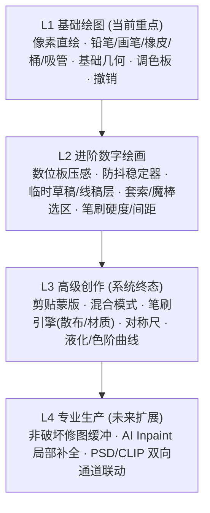
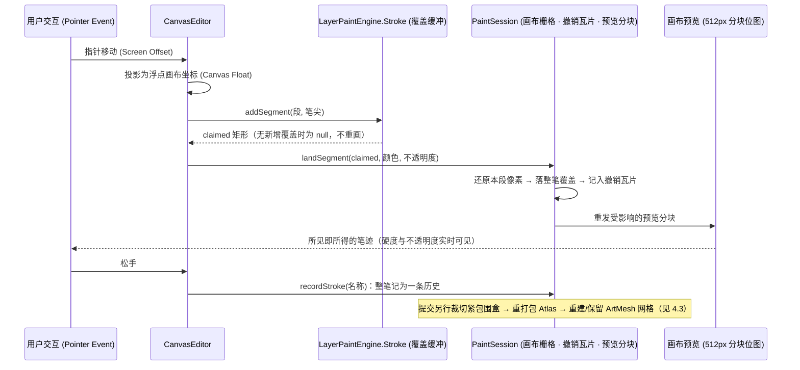

# PSD2Live 绘画系统（Paint Mode）功能架构与 PRD

## 1. 系统定位与核心愿景

### 1.1 背景与痛点
在 Live2D 模型制作流程中，部件贴图的重绘与修图（如消除拆件时的穿帮遮挡、补充眼球闭合/微睁的眼皮遮盖、修复重叠边缘毛刺、补齐嘴唇口腔内部贴图等）极其频繁。
传统方案中，建模师必须把贴图导出到外部软件（Photoshop/SAI/CSP）中修改保存，再重新导回 Live2D，不仅极其耗时，且在不同变形关键帧与网格蒙皮下无法即时预览修图效果。

### 1.2 核心设计哲学
- **独立专精的子系统**：绘画模式作为与“选择”、“变形”、“编辑”并列的独立模式，拥有独立设计的专属工具栏、交互逻辑与辅助条。
- **绑定单个图层进行重绘**：PSD2Live 的权威图层结构依然在 Live2D 骨架中。绘画模式**不需要承担庞大的全局图层树功能**，用户聚焦于**“挑选当前需要修绘的图层”**进行像素级编辑。
- **内部局部小图层 → 烘焙合并至 ArtMesh**：允许在绘画内部支持轻量级辅助临时层（如草稿层、上色层），但在外部最终烘焙并渲染至该图层绑定的 ArtMesh 纹理切片上。
- **所见即所得的参数化实时求值**：绘画内容直通当前图层纹理集（Atlas），即使在带有参数形变或物理摆动的状态下，也能实时呈现最终渲染效果。

---

## 2. 绘画功能分层架构（L1 ~ L4）

按照复杂度与创作流深度，将绘画系统划分为四层能力体系：

| 层级 | 功能分类 | 典型功能清单 | 目标参照与用户价值 |
|---|---|---|---|
| **L1 基础绘图** *(当前实现)* | **画布定位** | 挑选图层激活画布、图层原始尺寸/分辨率映射、视口无级缩放与平移 | **MS Paint 级极简直接**：聚焦在所选图层的像素重绘，零多余心智负担 |
| | **绘制工具** | 铅笔（硬像素边缘）、画笔（柔和抗锯齿）、橡皮擦（Alpha擦除）、油漆桶（区域填充）、吸管（色彩采样） | 满足 90% 的缝隙修补、边缘清理、修瑕需求 |
| | **几何图形** | 直线、矩形、圆形/椭圆（支持线框与实心填充） | 快速绘制遮罩块、眼睛高光轮廓等结构 |
| | **基础色彩** | 前景色/背景色切换、快捷色板预设、RGB/HSV 调色板 | 快速取色与微调对比度 |
| | **编辑操作** | 笔画级撤销/重做（Undo/Redo）、清除画布、矩形选区平移 | 容错与局部调整 |
| | **纹理渲染** | 实时写回 Atlas 页面，更新 Skia/ArtMesh 贴图 | 即画即看，即时呈现 |
| **L2 进阶绘画** | **临时图层** | 内部 2~3 层临时小图层（草稿层、线稿层、底色层），支持隐藏/透明度，最终一键合并至 ArtMesh | **SAI / Krita 级手绘感**：解决线稿与色彩分层问题 |
| | **笔刷进阶** | 笔尖大小无级缩放（`[` / `]`）、不透明度（Opacity）、流量（Flow）、硬度调节 | 细腻过渡与半透明上色 |
| | **设备支持** | 数位板/触控笔压感（Wacom/Windows Ink 压感映射半径与不透明度） | 真实画笔手感 |
| | **高级选区** | 自由套索、魔棒（容差匹配）、反选 | 复杂轮廓保护 |
| | **平滑防抖** | 笔画平滑稳定器（Stabilizer），自动消除手抖锯齿 | 顺滑勾线 |
| **L3 高级创作** | **混合与蒙版** | 临时小图层支持剪贴图层（Clipping）、正片叠底/发光/滤色等混合模式、锁定透明通道（Lock Alpha） | **CSP / Photoshop 级创作**：阴影与高光专业刻画 |
| | **高级笔刷** | 自定义笔刷形状、纹理印章（Texture）、噪点散布、动态旋转混色 | 复杂毛发与衣物纹理绘制 |
| | **辅助尺** | 对称尺（脸部中轴镜像直绘）、网格参考线、透视导向 | 左右对称五官高效产出 |
| | **色彩与形变**| 色相/饱和度/明度调节、曲线、液化笔刷（用于微调线条鼓包与流动） | 局部形态光影调谐 |
| **L4 专业生产** | **非破坏性** | 外部智能图层与原始源图无损保留、版本分支对比 | 专业生产管线与工业化交付 |
| | **辅助生成** | 遮挡缝隙智能内容识别填充（Inpainting）、超分辨率锐化联动 | AI 赋能重绘效率 |

---

## 3. L1 阶段详细功能规范（PRD）

### 3.1 核心流程（User Flow）
1. **进入绘画模式**：
   - 用户在顶部模式栏点击 **“绘画”**（顺序：选择 / 变形 / 编辑 / 绘画）。
   - 左侧工具栏平滑切换为绘画专属工具：**画笔、铅笔、橡皮、填充、吸管、图形（直线/矩形/圆）**。
   - 顶部/侧边显示当前前景色、笔刷大小、透明度、图层重绘状态。
2. **选择目标图层**：
   - 若尚未选中图层，提示“请在画布或层级树中选择一个图层开始绘画”。
   - 选中图层后，高亮该图层在画布中的边界，读取该图层在 Atlas 中的原始切片图像。
3. **笔刷绘制**：
   - 鼠标左键按下并拖动，在选定图层像素区域内进行绘制；笔尖随指针即时落笔，绘制中即可看到硬度与不透明度的实际效果。
   - 像素按**笔画的覆盖形状**落下：一次笔画只按指定不透明度落一次，与指针事件的疏密无关（详见 4.2）。
   - 绘制时支持实时双缓冲：鼠标松开时提交单次笔画历史，支持快捷键 `Ctrl+Z` 撤销、`Ctrl+Y` 重做。
   - 绘画的像素修改实时反映至 `PackedAtlas` 对应页面，驱动当前 ArtMesh 纹理无缝更新。
4. **辅助工具联动**：
   - **吸管**：指针经过处画一个**色环**（中心留空，指针下的像素因此不被遮挡；环带上半 = 指针下的颜色，下半 = 当前手中的颜色），旁边显示该颜色的 `#RRGGBB`；按住左键拖动可连续取样，松手才结束。`Alt` + 吸管取到背景色。空像素（Alpha = 0）无可取之色，手中颜色保持不变。
   - 按住 `Alt` 使用任意绘画工具：**指针悬停时即**临时变为吸管并显示该色环（与 Photoshop 一致），取到前景色，且不会在图层上留下任何像素、不记录历史。
   - **前景色 / 背景色**：调色板顶部以两个**叠放的正方形**色块表示（前方为前景，带高亮描边），旁边标注各自的 `#RRGGBB`；点击色块打开拾色器，`⇄` 按钮或画布上的 `X` 键交换两者（与 Photoshop 一致）。吸管 `Alt` 取色写入背景色，其余取色写入前景色。
   - 使用橡皮擦：擦除像素至透明（Alpha = 0）。
   - 使用油漆桶：基于点击像素点颜色和容差，泛滥填充目标连通区域。

### 3.2 工具栏详细定义（L1 工具集）

**形状工具是一支工具的三张面孔**：直线、矩形、椭圆同属 `PAINT_SHAPE`，与推拉笔刷的三种笔形一样，工具栏只占一行，选中该工具时其下方展开三个形状（图标 + 名称 + 各自快捷键），详情面板里也有同样的三个切换按钮。切换形状不需要切换工具，`U` / `Shift+R` / `Shift+O` 直接选中对应形状并同时装备该工具，`Shift+U` 依次循环三种形状。绘制手势对三者相同：按下定一角，拖动定另一角，松手落下；矩形/椭圆可选空心或实心，直线没有内部，填充选项对它自动隐藏。

笔尖（画笔 / 铅笔 / 橡皮）共有三个参数：**尺寸**、**硬度**（实心核心占半径的比例，1 为钢笔式硬边）与**不透明度**。
硬度决定「实心核心 → 外圈」之间的衰减：实心到 `半径 × 硬度`，到光标圈所画的半径处衰减为 0，因此**实际落笔范围不会超过预览圈**。
铅笔固定为硬边且不做边缘混合（这正是「铅笔」的定义），橡皮与该工具共用的硬度一致。
笔尖在拖动过程中即时落笔（不是抬笔才算），所以硬度和不透明度在拖动时就能看到；一次笔画仍只记入一条历史。
键盘：`[` / `]` 尺寸，`Shift+[` / `Shift+]` 硬度，`Alt+Shift+[` / `Alt+Shift+]` 不透明度；
或在画布上按住 `Alt` + 右键拖动——水平调尺寸、垂直调硬度，加 `Shift` 时垂直改调不透明度（与 Photoshop 一致）。
拖动时笔尖的衰减用与落笔完全相同的衰减曲线绘制，并在光标旁显示当前数值。

| 工具标识 | 快捷键 | 名称 | 功能定义与参数 |
|---|---|---|---|
| `PAINT_BRUSH` | `B` | **画笔** | 柔和抗锯齿边缘画笔，参数：半径（1~256px）、硬度（0~100%）、不透明度（0~100%）、颜色 |
| `PAINT_PENCIL` | `N` | **铅笔** | 硬边缘无抗锯齿像素笔，参数：尺寸、不透明度；适合勾勒确定性边缘或像素修补 |
| `PAINT_ERASER` | `E` | **橡皮擦** | 将目标区域 Alpha 值擦除，参数：尺寸、硬度、不透明度；随指针移动即时擦除，只留光标圈提示，不绘制灰色描边预览 |
| `PAINT_BUCKET` | `K` | **油漆桶** | 连通区域填充（Flood Fill），参数：容差（Tolerance 0~100）、当前前景色 |
| `PAINT_EYEDROPPER`| `I` | **吸管** | 采样指针下图层像素的 RGB：光标处画色环（中心留空以免遮挡所读像素，环带上半为取到的颜色、下半为前景色）并显示 `#RRGGBB`，按住拖动连续取样，`Alt` 取背景色；任意绘画工具上按住 `Alt` 悬停即临时变为此工具；空像素不改变手中颜色 |
| `PAINT_SHAPE` | `U` | **形状** | 一支工具三种形状（见下），参数：线宽/描边宽度、空心或实心、不透明度 |
| └ `PaintShape.LINE` | `U` | 直线 | 按下定起点，拖动定终点，松手栅格化（线宽取自画笔尺寸，不透明度同样生效） |
| └ `PaintShape.RECTANGLE` | `Shift+R` | 矩形 | 空心轮廓或实心填充（不透明度同样生效） |
| └ `PaintShape.ELLIPSE` | `Shift+O` | 椭圆 | 适合高光斑点或圆形结构（不透明度同样生效） |

---

## 4. 技术架构设计

### 4.1 坐标与像素映射
- 绘画发生在**文档画布（canvas）尺寸**的栅格上（`PaintSession.workingImage`），因此不受图层原有网格边界限制；与 Atlas 切片的对应关系只在提交时使用（`AtlasPlacement(page, x, y, width, height, scale)` 与 `AtlasSlice`）。
- 从视口坐标映射到画布像素时，笔尖使用**浮点**坐标（`CanvasViewport.canvasX(Float)`）：落笔落在两个像素之间，慢速拖动不会逐像素跳动；吸管、油漆桶等按像素取样的工具才取整。
- 画布栅格为 `BufferedImage(width, height, TYPE_INT_ARGB)`，撤销与预览都在其之上增量工作（见 4.2）。

### 4.2 笔画模型与撤销/重做
**笔画 = 覆盖（coverage）形状。** 每次落笔先把它扫过的胶囊区域写入笔画自己的覆盖缓冲（1 字节/像素，取「笔画经过此处的最强值」，不做叠加）：

- 像素覆盖决定这一笔在该处的浓淡，落笔时才乘上不透明度。因此笔画自交、往返、或慢速拖动都不会越描越浓，一次笔画只按指定不透明度落一次。
- 覆盖只由「指针去了哪里」决定，与事件被切成多少段无关：拖到一半的画面和抬笔后的画面逐像素一致，不会出现闪烁或「抬笔才算」。
- 橡皮使用同一份覆盖，以 `DstOut` 从图层 alpha 中扣除，所以半透明橡皮也不会越擦越透。

**实时落笔（Live Stroke）。** 光标每移动一段，只重画这一段刚刚新覆盖到的像素（`addSegment` 返回「覆盖刚刚增加的矩形」，笔画返程重叠的部分返回 null、不重画）：先把这些像素还原成笔画开始时的样子，再把笔画在该处的完整覆盖重新落上去。开销与「这一段的长度」成正比，而不是与「已经画了多长」成正比；橡皮的实时擦除同理。

**撤销/重做。** 每个编辑只记住被它替换掉的像素，并按 64×64 瓦片存放（`PixelPatch`）——一笔的代价是它实际触及的面积，与图层大小无关，也不再为每一笔复制整张画布：

- `restore` 把瓦片还回去但保留副本（实时笔画每段都要用到）；
- `swap` 与图层交换这些瓦片，即「撤销」；再交换一次即「重做」。多步跳转按顺序逐步交换。
- 任何绕过 `edit` / `willWrite` 的像素写入都不会被记录，也就无法撤销——这是会话对调用方的唯一约定。

**预览分块发布。** 画布看到的图层像素同样按块（512px）发布：一次落笔只重发它刚覆盖到的块，而不是整张图层位图。因此单次移动的花费与「画了多大」成正比，与图层尺寸无关（4K 图层下这是「每移动一次复制一整张画布」和「几十微秒」的区别）。分块发布与撤销走同一个约定：所有写入都必须经过会话，否则两者会一起失效。

### 4.3 提交与 ArtMesh 重建
- 提交时把绘制结果按紧包围盒裁切回图层，重新打包 Atlas，并弹出确认框：
  - **保留现有网格**：顶点与拓扑不变，仅把 UV 沿“图集切片 → 画布像素 → 新图集切片”重新寻址，因此图层重新裁切后贴图仍落在同一处画面位置。
  - **自动重建网格**：按最新像素重新生成外缘与三角面。
- **坐标帧不变量**：网格顶点保存的是“父变形器帧内的 0..1 位置”，因此重建必须沿用当前模型rig所依据的那份分析（`RigBuilder.rigContext`）推导出的帧。若改用绘制后的新包围盒重新推导帧，发丝/脸部/头部等帧会随之移动，而变形器并未重建，图层就会被父变形器的 lattice 重新缩放——表现为确认后模型出现预期外的变形。
- 对于分析描述不了的变形器（导入模型、手工搭建的 rig），从被替换的网格本身反解其归一化仿射（`local = a * canvas + b`）来还原帧。

---

## 5. 优先级规划与里程碑

- **阶段一 (当前实施 - L1 基础绘图闭环)**：
  - 顶部栏模式切换：选择 / 变形 / 编辑 / 绘画。
  - 变形模式移除创建路径变形器，仅在编辑模式展示。
  - 绘画模式专属工具栏（画笔、铅笔、橡皮、填充、吸管、直线/矩形/椭圆）。
  - 图层像素重绘底层双缓冲与 Atlas/ArtMesh 实时联动。
  - 基础颜色拾取器与调色板。
- **阶段二 (L2 进阶绘画体验)**：
  - 压感与防抖平滑。
  - 选区工具（套索/矩形选区/移动变换）。
  - 内部草稿图层支持。
- **阶段三 (L3 高级修图与创作)**：
  - 图层剪贴蒙版与常用混合模式。
  - 脸部中轴对称绘制尺。
  - 局部液化微调工具。

