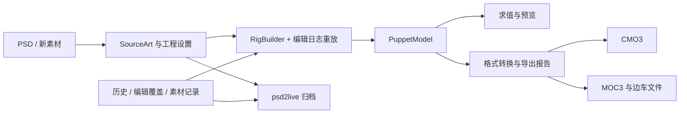

# 工程、运行时与导出边界

[文档目录](../../README.md) · [工程格式](PROJECT_FORMAT.md) · [实现导览](IMPLEMENTATION_COMPARISON.md)

按当前源码整理。解析器存在某个类型、保留原文件未知字段、能够在 UI 编辑，以及在目标软件中效果一致，是四种不同的支持程度。

## 数据流

| 层 | 主要对象 | 职责 |
| --- | --- | --- |
| 工程 | `SourceArt`、`AgentWorkspaceDocument`、历史和素材库 | 保存源像素、分类、配置、结构与可重放编辑 |
| 运行时 | `PuppetModel` | 参数、Part、Warp / Rotation、ArtMesh、Glue、关键形、通道与绘制关系 |
| 格式 | `Cmo3Model`、`MocDocument` | 编辑器对象图与运行时文件结构 |
| 求值与交付 | CPU / 原生预览、转换器、Pipeline、Sidecars | 采样、渲染、输出文件族与损失诊断 |

工程重开会重建 Rig 并重放编辑。新功能若只改 `PuppetModel` 而没有进入源工程或持久化编辑日志，重建后会丢失。画布、MCP 与保存流程都必须遵守这个边界。

## 当前产品入口

主画布已提供选择、形变、网格拓扑、变形器创建、Glue、路径和绘画会话。参数、检视、动画和物理面板提供相应控制。

GUI 与 MCP 的能力不完全相同：MCP 当前是 11 个公开工具，参数只公开 create/update，路径已公开，素材支持 create/split；低层对象方法不能自动视为公开接口。详见 [MCP 契约](../agent/MCP_AUTHORING.md)。

`org.umamo.edit` 的通用编辑会话也不是 PSD2Live 历史的唯一权威入口。接入底层编辑能力时，需要转换为工作区可保存、可重放的操作。

## 格式支持范围

| 内容 | 当前能力 | 需要区分的边界 |
| --- | --- | --- |
| 网格、Warp / Rotation、参数、普通关键形 | 核心模型、编辑与导出 | 跨父级换绑不等于全运动保真；源图 / 参数配置影响生成结果 |
| 颜色、透明度、绘制顺序、遮罩 | 模型与编辑通道 | 目标版本和格式表达能力可能带来降级 |
| Glue | 模型、可视创建与关键形 | 不等于完整的权重刷、配对修复工具链 |
| Blend Shape、Part 绘制组等 | 底层模型与格式映射 | 完整产品编辑工作流仍有缺口 |
| 变形路径 | 工作区编辑、CMO3 控制器、MOC3 烘焙 | 单 ArtMesh；未宣称与官方编辑算法一致 |
| 物理 | 生成器、工程配置、面板及简化 MCP | 不等于任意多输入 / 多输出 / 粒子链的完整编辑器 |
| 动作 | 基础动作生成与播放 | 不等于通用动作时间轴编辑 |
| Expression / Pose / UserData | 格式 / 边车层有相应处理 | 不能把透传当作完整可编辑工程资产 |
| ArtPath、Motion Sync、扩展插值与部分编辑器元数据 | 类型或原对象图可能存在 | 不能据此宣称从 PSD 可创建或完整语义编辑 |

CMO3 的格式库可以保留原对象图中的部分未知信息，但从 PSD 新建 CMO3 时只能合成已建模的数据。这是格式库能力，不代表主程序可直接打开所有 CMO3 工程。MOC3 由统一模型合成，不能依赖同样的未知字段透传。

## 文件族与验收

`.moc3` 不包含全部运行配置。贴图、`.model3.json`、显示信息、物理和动作等由边车文件共同表达，是否输出取决于设置及模型参数。

流水线检查中立、头部姿态、方向性变形器及格式读回，输出诊断和警告。文件存在只说明写出成功；还需检查报告、目标版本剥离及实际视觉效果。正式交付应在目标运行时加载整个文件族，并在目标编辑器检查需要继续编辑的 CMO3。

## 后续工作

重点包括统一边车资产模型、完整 Blend Shape / Glue 编辑、扩展插值、更多物理结构、导出损失的一致展示与真实兼容性样本。产品计划在[路线图](../../../ROADMAP.md)维护，不在此复制未验证完成状态。

新增功能至少覆盖：领域数据 → 历史重放 → 工程保存恢复 → 目标版本处理 → 导出读回 → 视觉检查。只有测试实际覆盖的范围才能写成兼容性结论。

源码：[工程](../../../src/main/kotlin/io/github/psd2live/project/) · [核心流水线](../../../src/main/kotlin/io/github/psd2live/core/) · [运行时](../../../src/main/kotlin/org/umamo/runtime/) · [格式转换](../../../src/main/kotlin/org/umamo/interop/)。
